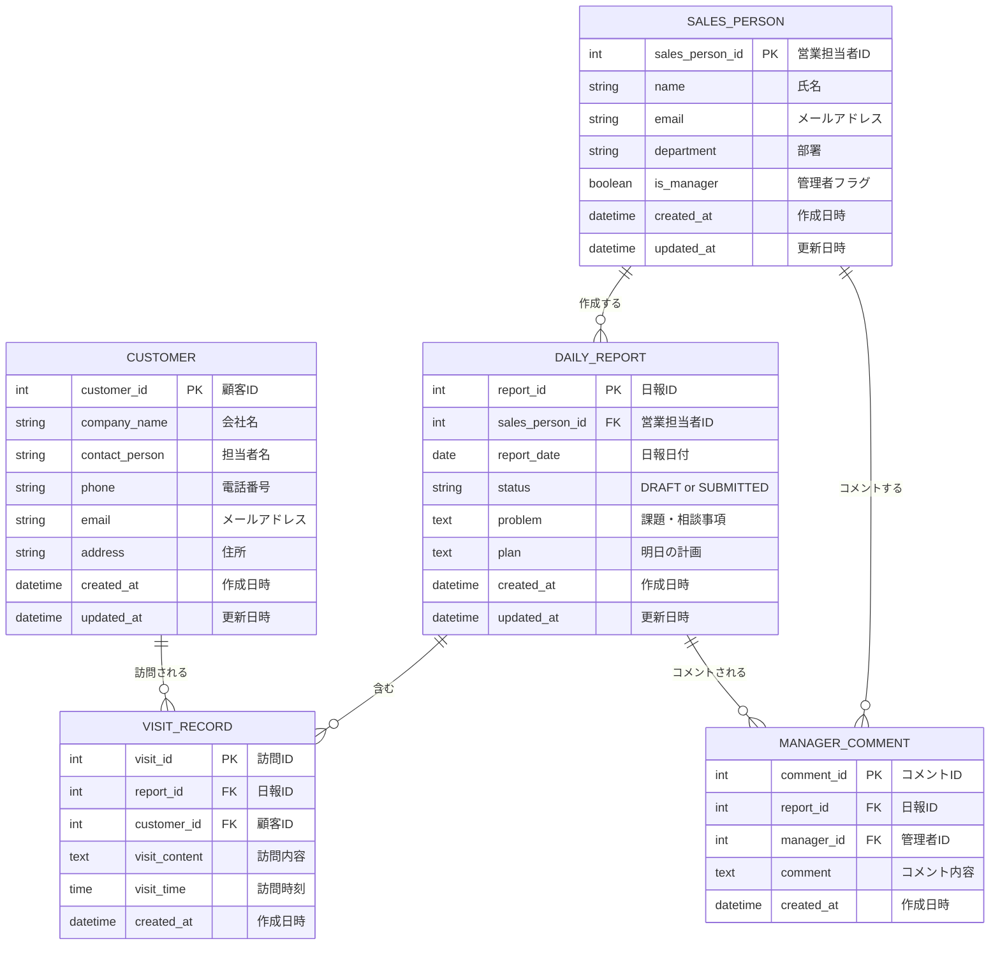

# 営業日報システム 要件定義書

## 1. 概要・目的

営業担当者が日々の訪問活動を報告し、上長がその内容を確認・コメントできる社内向け日報システムを構築する。

## 2. アクター（利用者）

| アクター       | 説明                                           |
| -------------- | ---------------------------------------------- |
| 営業           | 日々の訪問活動を日報として記録・提出する担当者 |
| 上長（管理者） | 全営業担当者の日報を閲覧し、コメントする担当者 |

- 営業担当者マスタ（SALES_PERSON）は `is_manager` フラグを持ち、これによって営業／上長を区別する。
- 営業と上長の対応関係（組織階層）は管理しない。`is_manager = true` のユーザーは全営業担当者の日報を閲覧・コメント可能とする。
- 認証はSupabase Authによるログインを実装済み（`SALES_PERSON.auth_user_id` でSupabase Authのユーザーと紐付ける）。ログイン中のセッションから「誰として操作しているか」を解決し、画面上でユーザーを選択・切り替える機構は持たない。

## 3. 機能要件

### 3.1 日報機能

- 営業は日付ごとに日報を1件作成する（同じ営業・同じ日付の日報は1件のみ）。
- 1つの日報には、訪問した顧客とその訪問内容の組を複数行、自由に追加・削除できる（顧客・訪問内容のペアを可変長で持つ）。訪問記録には訪問時刻を持たせる。
- 日報には以下の項目を記入する。
  - 対象日
  - 訪問記録（顧客 × 訪問内容 × 訪問時刻、複数行）
  - Problem（今の課題・相談）
  - Plan（明日やること）
- 日報にはステータスを持たせる。
  - **下書き（DRAFT）**：作成中で上長には見えない状態
  - **提出済み（SUBMITTED）**：上長が閲覧・コメント可能な状態
- 日報は作成後もいつでも編集可能（提出済みでも内容を書き換えられる）。
- 営業は自分の日報の一覧・詳細を閲覧できる。
- 上長は提出済みの日報の一覧・詳細を閲覧できる（全営業担当者分）。
- 一覧は日付・営業担当者で絞り込みできる。

### 3.2 コメント機能

- 上長は、提出済みの日報に対してコメント（MANAGER_COMMENT）を投稿できる。
- 1つの日報に対して複数のコメントを時系列（フラットなリスト）で表示する。返信のネスト構造は持たない。
- コメントは投稿者（上長）と投稿日時を表示する。

### 3.3 顧客マスタ

- 顧客情報を登録・編集・削除（一覧・詳細含む）できる。
- 保持する主な情報：会社名、担当者名、電話番号、メールアドレス、住所。
- 訪問記録から顧客を選択する際に参照される。

### 3.4 営業マスタ

- 営業担当者（および上長）情報を登録・編集・削除できる。
- 保持する主な情報：氏名、メールアドレス、部署、管理者フラグ（is_manager）。
- 管理者フラグに応じて閲覧・操作できる範囲が変わる（3.1, 3.2参照）。

## 4. 非機能要件（簡易）

- PC・スマートフォン双方のブラウザから利用できること（レスポンシブ対応）。外回りの営業がスマホから入力する想定。
- データはRDBに保存し、将来のデータ量増加やクエリ要件に耐えられる正規化されたテーブル設計とする。
- 将来的な通知機能の追加を妨げない設計とする（認証はSupabase Authにより実装済み）。

## 5. スコープ外（将来検討）

- 営業と上長の組織階層管理（誰が誰の上長か）
- コメントへの返信（スレッド化）
- 日報未提出者へのリマインド通知
- 訪問予定（アポイント）管理

## 6. 画面一覧（案）

| 画面                       | 概要                                                       |
| -------------------------- | ---------------------------------------------------------- |
| 日報一覧                   | 日付・営業担当者で絞り込み可能な一覧。ステータス表示       |
| 日報作成・編集             | 訪問記録の行追加・削除、Problem/Plan入力、下書き保存／提出 |
| 日報詳細                   | 訪問記録・Problem/Plan・コメント一覧の表示、コメント投稿   |
| 顧客マスタ一覧・登録・編集 | 顧客のCRUD                                                 |
| 営業マスタ一覧・登録・編集 | 営業担当者のCRUD                                           |

## 7. ER図

## 8. テーブル定義補足

### SALES_PERSON（営業マスタ）

| カラム          | 型       | 制約                    | 説明           |
| --------------- | -------- | ----------------------- | -------------- |
| sales_person_id | int      | PK                      |                |
| name            | string   | NOT NULL                | 氏名           |
| email           | string   | UNIQUE, NOT NULL        | メールアドレス |
| department      | string   | NULL可                  | 部署           |
| is_manager      | boolean  | NOT NULL, DEFAULT false | 管理者フラグ   |
| created_at      | datetime | NOT NULL                |                |
| updated_at      | datetime | NOT NULL                |                |

### CUSTOMER（顧客マスタ）

| カラム         | 型       | 制約     | 説明           |
| -------------- | -------- | -------- | -------------- |
| customer_id    | int      | PK       |                |
| company_name   | string   | NOT NULL | 会社名         |
| contact_person | string   | NULL可   | 先方担当者名   |
| phone          | string   | NULL可   | 電話番号       |
| email          | string   | NULL可   | メールアドレス |
| address        | string   | NULL可   | 住所           |
| created_at     | datetime | NOT NULL |                |
| updated_at     | datetime | NOT NULL |                |

### DAILY_REPORT（日報）

| カラム          | 型       | 制約                                         | 説明              |
| --------------- | -------- | -------------------------------------------- | ----------------- |
| report_id       | int      | PK                                           |                   |
| sales_person_id | int      | FK -> SALES_PERSON.sales_person_id, NOT NULL | 作成した営業      |
| report_date     | date     | NOT NULL                                     | 対象日            |
| status          | enum     | NOT NULL, DEFAULT 'DRAFT'                    | DRAFT / SUBMITTED |
| problem         | text     | NULL可                                       | 課題・相談        |
| plan            | text     | NULL可                                       | 明日やること      |
| created_at      | datetime | NOT NULL                                     |                   |
| updated_at      | datetime | NOT NULL                                     |                   |

- UNIQUE制約: (sales_person_id, report_date) — 同一営業・同一日付の日報は1件のみ

### VISIT_RECORD（訪問記録）

| カラム        | 型       | 制約                                   | 説明               |
| ------------- | -------- | -------------------------------------- | ------------------ |
| visit_id      | int      | PK                                     |                    |
| report_id     | int      | FK -> DAILY_REPORT.report_id, NOT NULL | どの日報に属するか |
| customer_id   | int      | FK -> CUSTOMER.customer_id, NOT NULL   | 訪問した顧客       |
| visit_content | text     | NOT NULL                               | 訪問内容           |
| visit_time    | time     | NULL可                                 | 訪問時刻           |
| created_at    | datetime | NOT NULL                               |                    |

### MANAGER_COMMENT（上長コメント）

| カラム     | 型       | 制約                                         | 説明                   |
| ---------- | -------- | -------------------------------------------- | ---------------------- |
| comment_id | int      | PK                                           |                        |
| report_id  | int      | FK -> DAILY_REPORT.report_id, NOT NULL       | 対象の日報             |
| manager_id | int      | FK -> SALES_PERSON.sales_person_id, NOT NULL | コメント投稿者（上長） |
| comment    | text     | NOT NULL                                     | コメント内容           |
| created_at | datetime | NOT NULL                                     |                        |
