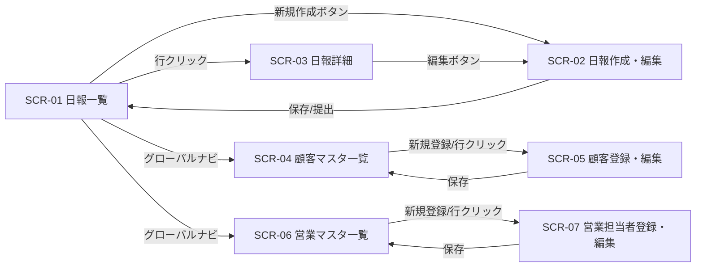

# 営業日報システム 画面定義書

本書は `docs/requirements.md` の要件・ER図を前提とした画面定義である。実装はまだ行わない。

## 0. 共通仕様

### 0.1 レイアウト共通

全画面共通のヘッダーを持つ。認証はSupabase Authによるログインを前提とし、未ログイン状態でアクセスした場合はログイン画面（`/login`）へリダイレクトする。

```
┌─────────────────────────────────────────────────────┐
│ 営業日報システム   [日報] [顧客マスタ] [営業マスタ]     │
│                        山田太郎（営業）  [ログアウト] │
├─────────────────────────────────────────────────────┤
│                                                       │
│                    （各画面のコンテンツ）              │
│                                                       │
└─────────────────────────────────────────────────────┘
```

| 要素                   | 内容                                                                                                                                                                                                                                                           |
| ---------------------- | -------------------------------------------------------------------------------------------------------------------------------------------------------------------------------------------------------------------------------------------------------------- |
| グローバルナビ         | 「日報」「顧客マスタ」「営業マスタ」の3メニュー。クリックで各一覧画面に遷移                                                                                                                                                                                    |
| ログイン中ユーザー表示 | ログイン中のSupabase Authセッションから解決した `SALES_PERSON` の氏名・区分（`is_manager` を「営業」/「上長」に変換）を表示するのみで、他ユーザーへの切り替えはできない。閲覧・操作できる範囲は、このログイン中ユーザーの `is_manager` により決まる（0.2参照） |
| ログアウト             | クリックでSupabase Authのセッションを破棄し、ログイン画面（`/login`）へ遷移する                                                                                                                                                                                |

ログイン・ログアウト・パスワード再設定（パスワード再設定メール送信・新パスワード設定）・新規担当者の招待といったSupabase Auth関連の画面・フローは本書のSCR一覧（0.3）の対象外とする（今後の追補を検討）。

### 0.1.1 レスポンシブ方針

`docs/requirements.md` 4. 非機能要件（外回りの営業がスマホから入力する想定）に対応するため、PC・スマートフォン双方で利用できることを前提に実装する。

- **モバイルファースト**: Tailwind CSSの標準ブレークポイントをそのまま使用する（独自のブレークポイント追加は行わない）。`sm`(640px) / `md`(768px) / `lg`(1024px) / `xl`(1280px) / `2xl`(1536px)。
- **主要な切り替え幅**: `md`(768px)を境界とする。
  - `md`未満（スマートフォン想定）: グローバルナビはハンバーガーメニュー等に格納し、一覧画面のテーブルは横スクロールまたはカード型レイアウトで表示する。
  - `md`以上（PC想定）: ヘッダーの3メニューを横並び表示し、一覧画面は通常のテーブルで表示する。
- **タップ操作への配慮**: スマートフォンからの入力を想定し、ボタン・入力欄等の操作対象は十分なタップ領域を確保する（shadcn/uiの標準サイズに準拠し、独自に縮小しない）。
- 各画面の実装（SCR-01〜07）は、上記方針に従って個別にレスポンシブ対応を行う。本書はページごとのブレークポイント別デザインまでは規定しない。

### 0.2 権限の考え方

| 状態                   | 営業（is_manager = false）            | 上長（is_manager = true）                      |
| ---------------------- | ------------------------------------- | ---------------------------------------------- |
| 日報の閲覧             | 自分の日報のみ（DRAFT/SUBMITTED両方） | 全営業のSUBMITTEDのみ                          |
| 日報の作成・編集       | 自分の日報のみ可                      | 自分の日報のみ可（上長も自分の日報を書く想定） |
| コメント投稿           | 不可                                  | 可（他営業のSUBMITTED日報に対して）            |
| 顧客マスタ・営業マスタ | 閲覧・編集可（今回は権限分離しない）  | 閲覧・編集可                                   |

※ マスタ管理を上長のみに限定するかは今後の検討事項とする（現時点では全ユーザーに許可）。

### 0.3 画面一覧・画面遷移

| 画面ID | 画面名               |
| ------ | -------------------- |
| SCR-01 | 日報一覧             |
| SCR-02 | 日報作成・編集       |
| SCR-03 | 日報詳細             |
| SCR-04 | 顧客マスタ一覧       |
| SCR-05 | 顧客登録・編集       |
| SCR-06 | 営業マスタ一覧       |
| SCR-07 | 営業担当者登録・編集 |



---

## SCR-01 日報一覧

- **URL（案）**: `/reports`
- **アクセス**: 全ユーザー（表示内容は現在のユーザーにより異なる）
- **目的**: 自分（営業）または部下全員（上長）の日報を一覧で確認する

### 画面イメージ

```
┌─────────────────────────────────────────────┐
│ 日報一覧                        [＋新規作成] │
│                                               │
│ 対象日 [____] 〜 [____]  営業 [全員 ▼] [検索]│
│                                               │
│ ┌───────┬──────────┬────────┬────────┐    │
│ │ 日付   │ 営業担当者 │ ステータス│訪問件数│    │
│ ├───────┼──────────┼────────┼────────┤    │
│ │08/25   │山田太郎    │提出済み │  3件   │→詳細│
│ │08/24   │山田太郎    │下書き   │  1件   │→詳細│
│ └───────┴──────────┴────────┴────────┘    │
└─────────────────────────────────────────────┘
```

### 表示・入力項目

| 項目               | 種別                   | 説明                                                           |
| ------------------ | ---------------------- | -------------------------------------------------------------- |
| 対象日（From/To）  | 検索条件（日付）       | 未入力の場合は全期間                                           |
| 営業担当者         | 検索条件（プルダウン） | 上長ログイン時のみ表示。SALES_PERSON一覧から選択、未選択で全員 |
| 一覧行：日付       | 表示                   | `report_date`                                                  |
| 一覧行：営業担当者 | 表示                   | 上長ログイン時のみ列を表示                                     |
| 一覧行：ステータス | 表示                   | DRAFT=「下書き」/ SUBMITTED=「提出済み」                       |
| 一覧行：訪問件数   | 表示                   | 紐づく `VISIT_RECORD` の件数                                   |

### アクション

| 操作                 | 挙動                                               |
| -------------------- | -------------------------------------------------- |
| 「＋新規作成」ボタン | SCR-02（新規）へ遷移。対象日は当日をデフォルト表示 |
| 一覧行クリック       | SCR-03（該当日報の詳細）へ遷移                     |
| 「検索」ボタン       | 条件で一覧を再取得                                 |

### 特記事項

- 営業ログイン時：営業担当者の絞り込み条件・列は非表示（常に自分の日報のみ）。
- 上長ログイン時：ステータスがSUBMITTEDの日報のみ表示（DRAFTは表示しない）。
- 同一日付の日報は既に存在する場合、「＋新規作成」で対象日を選択し直すか、既存行から編集する（3.1のUNIQUE制約）。

---

## SCR-02 日報作成・編集

- **URL（案）**: `/reports/new`, `/reports/:id/edit`
- **アクセス**: 日報の作成者本人のみ
- **目的**: 訪問記録・Problem・Planを入力し、下書き保存または提出する

### 画面イメージ

```
┌─────────────────────────────────────────────┐
│ 日報作成・編集                                │
│                                               │
│ 対象日： [2026-08-25 ▼]                       │
│                                               │
│ 訪問記録                                      │
│ ┌────────┬──────────────┬────────┬────┐   │
│ │顧客     │訪問内容        │訪問時刻│削除│   │
│ ├────────┼──────────────┼────────┼────┤   │
│ │[A社 ▼] │[新商品の提案...] │[10:00] │[×] │   │
│ │[B社 ▼] │[定期フォロー...] │[13:30] │[×] │   │
│ └────────┴──────────────┴────────┴────┘   │
│ [＋訪問記録を追加]                            │
│                                               │
│ Problem（課題・相談）                          │
│ ┌───────────────────────────────────┐     │
│ │                                     │     │
│ └───────────────────────────────────┘     │
│                                               │
│ Plan（明日やること）                           │
│ ┌───────────────────────────────────┐     │
│ │                                     │     │
│ └───────────────────────────────────┘     │
│                                               │
│           [下書き保存]   [提出する]           │
└─────────────────────────────────────────────┘
```

### 表示・入力項目

| 項目               | 種別                   | 必須                 | 説明                                                                   |
| ------------------ | ---------------------- | -------------------- | ---------------------------------------------------------------------- |
| 対象日             | 日付選択               | 必須                 | 新規時は当日をデフォルト。同一営業・同一日付が既に存在する場合はエラー |
| 訪問記録：顧客     | プルダウン（CUSTOMER） | 必須（行がある場合） | 顧客マスタから選択                                                     |
| 訪問記録：訪問内容 | テキストエリア         | 必須（行がある場合） | `visit_content`                                                        |
| 訪問記録：訪問時刻 | 時刻入力               | 任意                 | `visit_time`                                                           |
| Problem            | テキストエリア         | 任意                 | `problem`                                                              |
| Plan               | テキストエリア         | 任意                 | `plan`                                                                 |

### アクション

| 操作                 | 挙動                                                               |
| -------------------- | ------------------------------------------------------------------ |
| 「＋訪問記録を追加」 | 訪問記録の行を1行追加（顧客・訪問内容・訪問時刻・削除ボタン）      |
| 各行の「×」          | その訪問記録行を削除（保存前ならUI上のみ、保存済みならDB上も削除） |
| 「下書き保存」       | `status = DRAFT` として保存し、SCR-01へ戻る                        |
| 「提出する」         | `status = SUBMITTED` として保存し、SCR-01へ戻る                    |

### バリデーション

- 対象日は必須。同一営業担当者・同一対象日の日報が既に存在する場合（自分自身の編集を除く）は保存不可としエラーメッセージを表示。
- 訪問記録は0行でも保存可能（下書き段階を想定）とするが、「提出する」時は最低1行を必須とする。
- 訪問記録の行は、顧客・訪問内容の両方が入力されている必要がある（片方のみは不可）。

---

## SCR-03 日報詳細

- **URL（案）**: `/reports/:id`
- **アクセス**: 作成者本人、または上長（対象がSUBMITTEDの場合のみ）
- **目的**: 日報の内容を確認し、上長がコメントを投稿する

### 画面イメージ

```
┌─────────────────────────────────────────────┐
│ 日報詳細（2026-08-25 / 山田太郎 / 提出済み）  [編集] │
│                                               │
│ 訪問記録                                      │
│ ・10:00 A社 — 新商品の提案を実施              │
│ ・13:30 B社 — 定期フォロー訪問                │
│                                               │
│ Problem                                       │
│ 　A社の見積もり承認が遅れている               │
│                                               │
│ Plan                                          │
│ 　C社へ初回訪問予定                            │
│                                               │
│ ─────────────────────────────               │
│ コメント                                       │
│ 　[08/25 14:10] 鈴木上長：見積もりの件、私からも確認します│
│                                               │
│ ┌───────────────────────────────────┐     │
│ │（コメント入力欄）                    │     │
│ └───────────────────────────────────┘     │
│                                     [投稿]   │
└─────────────────────────────────────────────┘
```

### 表示・入力項目

| 項目           | 種別           | 説明                                                        |
| -------------- | -------------- | ----------------------------------------------------------- |
| ヘッダー情報   | 表示           | 対象日、営業担当者名、ステータス                            |
| 訪問記録一覧   | 表示           | 訪問時刻順に、顧客名・訪問内容を列挙                        |
| Problem        | 表示           |                                                             |
| Plan           | 表示           |                                                             |
| コメント一覧   | 表示           | 投稿日時・投稿者（上長）・本文を時系列（古い→新しい）で列挙 |
| コメント入力欄 | テキストエリア | 上長ログイン時のみ表示                                      |

### アクション

| 操作           | 挙動                                                       |
| -------------- | ---------------------------------------------------------- |
| 「編集」ボタン | 作成者本人がログイン中の場合のみ表示。SCR-02（編集）へ遷移 |
| 「投稿」ボタン | 上長ログイン時のみ表示。コメントを登録し、一覧を再表示     |

### 特記事項

- ステータスがDRAFTの日報は、作成者本人以外（上長含む）はアクセス不可（一覧にも出てこないため通常到達しないが、直接URLアクセスされた場合はエラー表示とする）。
- コメント欄は営業ログイン時には非表示（投稿不可）。

---

## SCR-04 顧客マスタ一覧

- **URL（案）**: `/customers`
- **アクセス**: 全ユーザー
- **目的**: 登録済み顧客の確認・新規登録・編集導線

### 画面イメージ

```
┌─────────────────────────────────────────────┐
│ 顧客マスタ                        [＋新規登録]│
│                                               │
│ 会社名 [__________] [検索]                    │
│                                               │
│ ┌──────────┬──────────┬────────┬────┐    │
│ │会社名      │担当者名    │電話番号 │    │    │
│ ├──────────┼──────────┼────────┼────┤    │
│ │A社         │佐藤様      │03-xxxx  │→編集│    │
│ │B社         │高橋様      │06-xxxx  │→編集│    │
│ └──────────┴──────────┴────────┴────┘    │
└─────────────────────────────────────────────┘
```

### 表示・入力項目

| 項目                               | 種別                 | 説明                                        |
| ---------------------------------- | -------------------- | ------------------------------------------- |
| 会社名                             | 検索条件（部分一致） |                                             |
| 一覧：会社名 / 担当者名 / 電話番号 | 表示                 | `company_name` / `contact_person` / `phone` |

### アクション

| 操作           | 挙動                 |
| -------------- | -------------------- |
| 「＋新規登録」 | SCR-05（新規）へ遷移 |
| 一覧行クリック | SCR-05（編集）へ遷移 |

---

## SCR-05 顧客登録・編集

- **URL（案）**: `/customers/new`, `/customers/:id/edit`
- **アクセス**: 全ユーザー
- **目的**: 顧客情報の登録・更新・削除

### 画面イメージ

```
┌─────────────────────────────────────────────┐
│ 顧客登録・編集                                │
│                                               │
│ 会社名＊     [_____________________]          │
│ 担当者名     [_____________________]          │
│ 電話番号     [_____________________]          │
│ メールアドレス [_____________________]          │
│ 住所         [_____________________]          │
│                                               │
│        [削除]            [キャンセル] [保存]  │
└─────────────────────────────────────────────┘
```

### 表示・入力項目

| 項目           | 種別     | 必須 | 説明             |
| -------------- | -------- | ---- | ---------------- |
| 会社名         | テキスト | 必須 | `company_name`   |
| 担当者名       | テキスト | 任意 | `contact_person` |
| 電話番号       | テキスト | 任意 | `phone`          |
| メールアドレス | テキスト | 任意 | `email`          |
| 住所           | テキスト | 任意 | `address`        |

### アクション

| 操作           | 挙動                                                   |
| -------------- | ------------------------------------------------------ |
| 「保存」       | 入力内容を登録/更新し、SCR-04へ戻る                    |
| 「キャンセル」 | 変更を破棄しSCR-04へ戻る                               |
| 「削除」       | 編集時のみ表示。確認ダイアログの上、削除しSCR-04へ戻る |

### 特記事項

- 削除対象の顧客が `VISIT_RECORD` から参照されている場合、削除不可としエラーメッセージを表示する（データ整合性のため）。

---

## SCR-06 営業マスタ一覧

- **URL（案）**: `/sales-persons`
- **アクセス**: 全ユーザー
- **目的**: 営業担当者・上長の一覧確認と登録導線

### 画面イメージ

```
┌─────────────────────────────────────────────┐
│ 営業マスタ                        [＋新規登録]│
│                                               │
│ ┌──────────┬──────────┬────────┬────────┐│
│ │氏名        │メールアドレス│部署    │区分     ││
│ ├──────────┼──────────┼────────┼────────┤│
│ │山田太郎    │yamada@..  │営業1課 │営業     │→編集││
│ │鈴木一郎    │suzuki@..  │営業1課 │上長     │→編集││
│ └──────────┴──────────┴────────┴────────┘│
└─────────────────────────────────────────────┘
```

### 表示・入力項目

| 項目                                      | 種別 | 説明                                                  |
| ----------------------------------------- | ---- | ----------------------------------------------------- |
| 一覧：氏名 / メールアドレス / 部署 / 区分 | 表示 | 区分は `is_manager` を「営業」/「上長」に変換して表示 |

### アクション

| 操作           | 挙動                 |
| -------------- | -------------------- |
| 「＋新規登録」 | SCR-07（新規）へ遷移 |
| 一覧行クリック | SCR-07（編集）へ遷移 |

---

## SCR-07 営業担当者登録・編集

- **URL（案）**: `/sales-persons/new`, `/sales-persons/:id/edit`
- **アクセス**: 全ユーザー
- **目的**: 営業担当者・上長情報の登録・更新・削除

### 画面イメージ

```
┌─────────────────────────────────────────────┐
│ 営業担当者登録・編集                          │
│                                               │
│ 氏名＊        [_____________________]         │
│ メールアドレス＊ [_____________________]         │
│ 部署         [_____________________]         │
│ 上長として登録する  [ ] （is_manager）          │
│                                               │
│        [削除]            [キャンセル] [保存]  │
└─────────────────────────────────────────────┘
```

### 表示・入力項目

| 項目               | 種別             | 必須                  | 説明         |
| ------------------ | ---------------- | --------------------- | ------------ |
| 氏名               | テキスト         | 必須                  | `name`       |
| メールアドレス     | テキスト         | 必須・一意            | `email`      |
| 部署               | テキスト         | 任意                  | `department` |
| 上長として登録する | チェックボックス | 任意（デフォルトOFF） | `is_manager` |

### アクション

| 操作           | 挙動                                                   |
| -------------- | ------------------------------------------------------ |
| 「保存」       | 入力内容を登録/更新し、SCR-06へ戻る                    |
| 「キャンセル」 | 変更を破棄しSCR-06へ戻る                               |
| 「削除」       | 編集時のみ表示。確認ダイアログの上、削除しSCR-06へ戻る |

### 特記事項

- メールアドレスの重複は保存時にエラーとする。
- 削除対象の営業担当者が `DAILY_REPORT` や `MANAGER_COMMENT` から参照されている場合、削除不可としエラーメッセージを表示する（データ整合性のため）。
